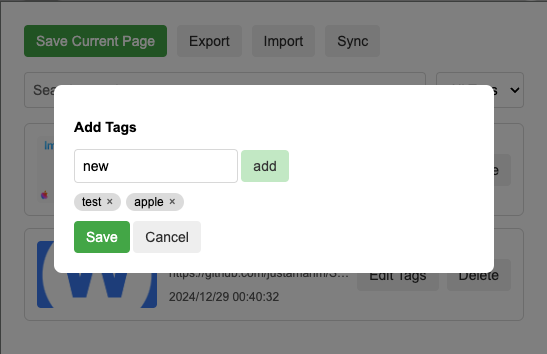

# See for Later

**See for Later** is a Chrome extension for saving websites you want to browse later. It supports adding, deleting, tag management, import/export, and search functionality, making it easy for users to manage their webpage list.

Why not use default bookmarks?
Well, good question. Maybe it's slightly more convenient 🤔

---

## Features

### 1. **Save Current Page**
- Click the "Save Current Page" button to save the current browser page to your list
- Saved pages include title, URL, thumbnail, timestamp, and tags

### 2. **Search and Filter**
- **Search**: Find saved pages in real-time through the search box
- **Tag Filtering**: Filter results based on page tags, with dynamic tag list updates

### 3. **Tag Management**
- Add, edit, or delete tags for pages
- Tags update in real-time, supporting page filtering by tags

### 4. **Import/Export**
- Export: Export all saved pages in JSON format
- Import: Import page data from JSON files, automatically merging with existing data

### 5. **Delete Pages**
- One-click deletion of specified pages, with synchronized updates to page list and tags

---

## Installation

### 1. Install from Source
1. Download the project source code locally
2. Open Chrome and visit `chrome://extensions/`
3. Enable **Developer Mode** in the top right corner
4. Click **Load unpacked extension** and select the project folder

### 2. Install from Web Store (Future Available)
- Once the extension is uploaded to the Chrome Web Store, you can install directly from there

---

## Usage Guide

### 1. Save Pages
- Open the extension popup and click the "Save Current Page" button
- The page will be saved to your list

### 2. Search and Filter
- Enter keywords in the search box to find matching pages in real-time
- Use the tag filter to display pages matching selected tags

### 3. Manage Tags
- Click the "Edit Tags" button to open the tag editing dialog
- Add new tags or delete existing ones, then click "Save" to save changes

### 4. Import/Export Data
- Click the "Export" button to copy or download page data
- Click the "Import" button to paste JSON data and import

### 5. Delete Pages
- Click the "Delete" button on the page card to remove that page

---

## File Structure

```
├── manifest.json         # Chrome extension configuration file
├── popup.html           # Extension popup HTML file
├── popup.js            # Core JavaScript file for extension functionality
├── icons/              # Extension icon files
├── styles/             # CSS style files (optional)
└── README.md           # Project documentation
```

---

## Developer Guide

### Requirements
- Chrome browser
- Node.js (optional, for build tools)

### Development Steps
1. Clone this project:
   ```bash
   git clone <repository-url>
   ```
2. Load the unpacked extension in Chrome:
   - Open `chrome://extensions/`
   - Click **Load unpacked extension**
3. After code modifications, click **Reload** to update the extension

### Debugging
- Use Chrome DevTools to debug the extension's background scripts, popup pages, or content scripts
- Add `console.log` in `popup.js` to view output logs

---

## License
This project is released under the MIT License. You are free to modify, distribute, and use this project while maintaining the original declaration.

---

### Screenshot Examples



