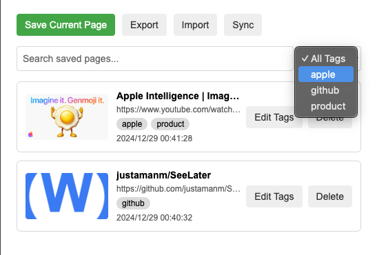
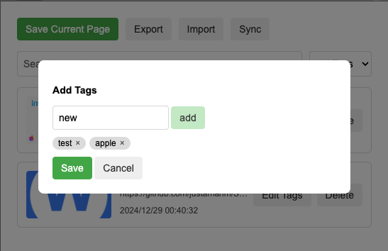

# See for Later

**See for Later** 是一个 Chrome 插件，用于保存想要稍后浏览的网站列表。它支持添加、删除、标签管理、导入/导出以及搜索功能，让用户轻松管理自己的网页清单。

为什么不使用默认书签？
嗯，好问题。可能是稍微方便些🤔

---

## 功能简介

### 1. **保存当前页面**
- 点击 "Save Current Page" 按钮，将当前浏览器页面保存到清单中。
- 保存的页面包含标题、URL、缩略图、时间戳及标签。

### 2. **搜索和筛选**
- **搜索**：通过搜索框实时查找已保存的页面。
- **标签筛选**：根据页面标签筛选结果，支持动态更新标签列表。

### 3. **标签管理**
- 为页面添加、编辑或删除标签。
- 标签实时更新，支持通过标签筛选页面。

### 4. **导入/导出**
- 导出：以 JSON 格式导出所有已保存的页面。
- 导入：从 JSON 文件导入页面数据，自动合并到现有数据中。

### 5. **删除页面**
- 一键删除指定页面，支持同步更新页面列表和标签。

---

## 安装方法

### 1. 从源码安装
1. 下载本项目源码到本地。
2. 打开 Chrome，访问 `chrome://extensions/`。
3. 打开右上角的 **开发者模式**。
4. 点击 **加载已解压的扩展程序**，选择项目文件夹。

### 2. 从 Web Store 安装（未来可用）
- 插件上传到 Chrome Web Store 后，您可以直接从商店安装。

---

## 使用指南

### 1. 保存页面
- 打开扩展弹窗，点击 "Save Current Page" 按钮。
- 页面将被保存到清单中。

### 2. 搜索和筛选
- 在搜索框输入关键词，实时查找匹配的页面。
- 使用标签筛选器选择标签，显示匹配的页面。

### 3. 管理标签
- 点击 "Edit Tags" 按钮，打开标签编辑对话框。
- 添加新标签或删除已有标签后，点击 "Save" 保存更改。

### 4. 导入/导出数据
- 点击 "Export" 按钮，复制或下载页面数据。
- 点击 "Import" 按钮，粘贴 JSON 数据并导入。

### 5. 删除页面
- 在页面卡片中点击 "Delete" 按钮，即可删除该页面。

---

## 文件结构

```
├── manifest.json         # Chrome 插件配置文件
├── popup.html            # 插件弹窗的 HTML 文件
├── popup.js              # 插件功能的核心 JavaScript 文件
├── icons/                # 插件图标文件
├── styles/               # CSS 样式文件（可选）
└── README.md             # 项目说明文件
```

---

## 开发者指南

### 环境要求
- Chrome 浏览器
- Node.js（可选，用于打包工具）

### 开发步骤
1. 克隆本项目：
   ```bash
   git clone <repository-url>
   ```
2. 在 Chrome 中加载未打包的插件：
   - 打开 `chrome://extensions/`。
   - 点击 **加载已解压的扩展程序**。
3. 修改代码后，点击 **重新加载** 更新插件。

### 调试
- 使用 Chrome DevTools 调试插件的背景脚本、弹窗页面或内容脚本。
- 在 `popup.js` 中添加 `console.log` 查看输出日志。

---

## 许可
本项目基于 MIT 许可发布。您可以自由修改、分发和使用本项目，但需保留原始声明。

---

### 示例截图



